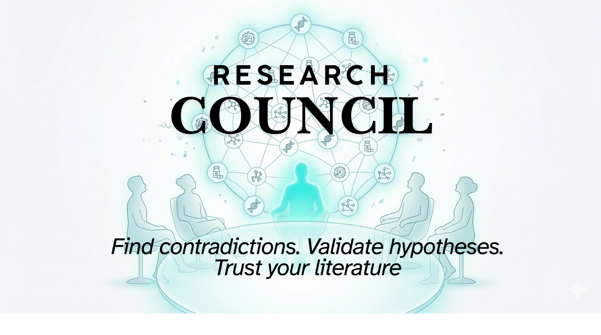
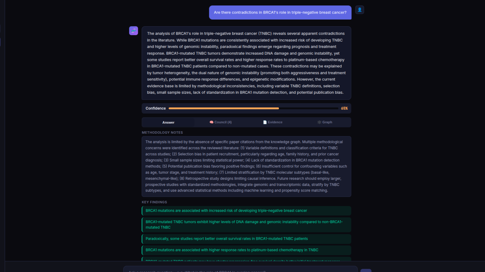
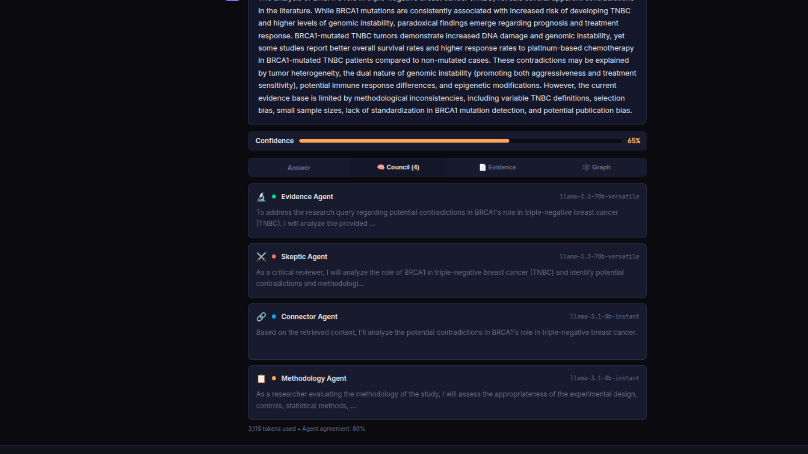
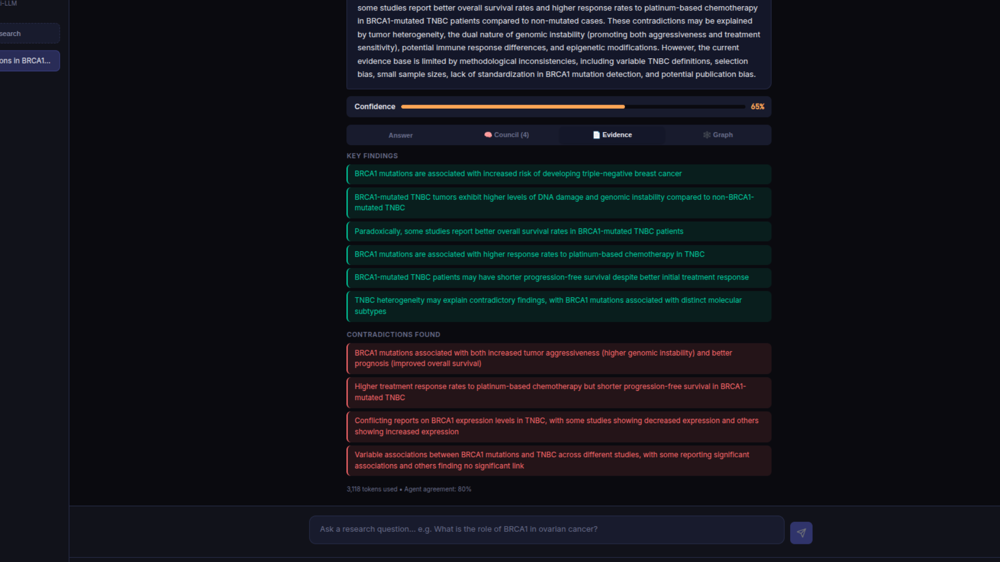
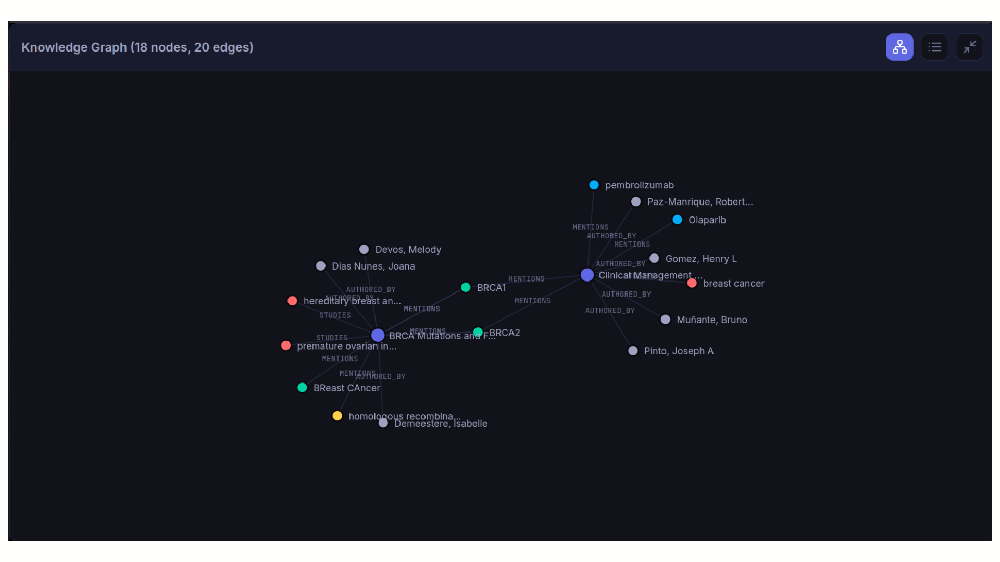
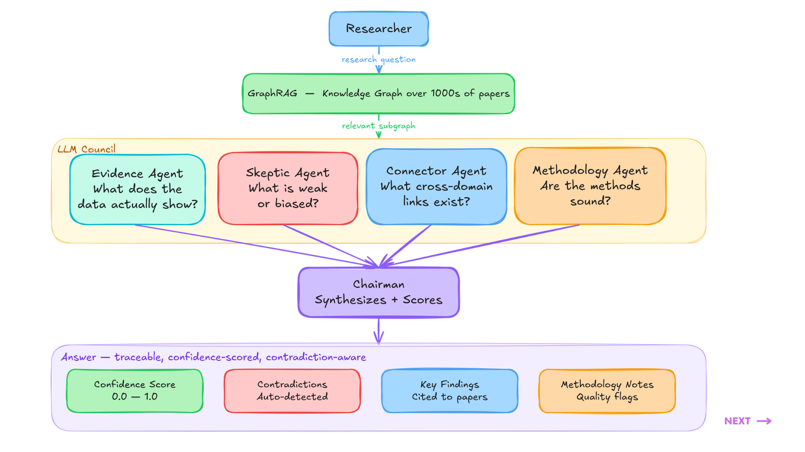

<div align="center">



<br/>

[](https://python.org)
[](LICENSE)
[](https://github.com/langchain-ai/langgraph)
[](https://neo4j.com)
[](https://groq.com)
[](https://openrouter.ai)

**4 AI agents deliberate over a knowledge graph of scientific papers.**  
**They debate. They disagree. Then they give you one honest, cited answer.**

[ Quick Start](#quick-start) · [ How It Works](#how-it-works) · [ Use Cases](#use-cases) · [ Architecture](#architecture) · [ Contributing](#contributing)

</div>

---

## Why Research Council?

Every AI tool gives you **one confident answer**. The problem? Science doesn't work that way.

| | ChatGPT / Copilot | **Research Council** |
|---|---|---|
| Answer source | Single model | 4 specialized agents |
| Confidence | Always high | Calibrated (0–100%) |
| Contradictions | Hidden | **Explicitly surfaced** |
| Citations | Sometimes | Every claim cited |
| Methodology critique | None | Dedicated agent |
| Knowledge base | Training data | **Your papers, your graph** |

> *"3,118 tokens. 80% agent agreement. 65% confidence. That's the difference between one opinion and a deliberated verdict."*

---

## Demo



*Query: "Are there contradictions in BRCA1's role in triple-negative breast cancer?"*  
*Result: 65% confidence · 4 contradictions found · 6 key findings · 8 methodology flags*

---

## How It Works

### Step 1 — Build Your Knowledge Graph
Ingest papers from PubMed, arXiv, Semantic Scholar, or upload PDFs directly. Research Council extracts entities (genes, drugs, diseases, pathways) and maps their relationships into a Neo4j knowledge graph.

### Step 2 — Ask a Research Question
Type any biomedical research question. The system retrieves the most relevant subgraph and paper chunks — not 20,000 tokens of noise, but a focused ~2,000 token context.

### Step 3 — The Council Deliberates



Four specialized agents analyze in **parallel**:

| Agent | Question It Answers |
|---|---|
| 🔬 **Evidence Agent** | What does the data actually show? |
| ⚔️ **Skeptic Agent** | What is weak, biased, or underpowered? |
| 🔗 **Connector Agent** | What cross-domain links exist? |
| 📋 **Methodology Agent** | Are the methods sound? |

Then they **cross-review each other** (12 peer evaluations). The **Chairman** synthesizes a final verdict.

### Step 4 — Get a Trustworthy Answer



Every answer includes:
- **Confidence score** — calibrated, not inflated
- **Key findings** — cited to specific papers
- **Contradictions found** — highlighted explicitly in red
- **Methodology notes** — quality flags on the evidence

### Step 5 — Explore the Knowledge Graph



Every conclusion is written back into the graph as a new node — with provenance trails connecting it to the source papers. The graph gets smarter with every query.

---

## Use Cases

**🧬 Contradiction Detection**
> *"Are there contradictions in KRAS G12C inhibitor resistance mechanisms?"*  
Find where the literature conflicts before you design your next experiment.

**💊 Hypothesis Validation**
> *"Has metformin been tested in glioblastoma? What failed and why?"*  
Check if your hypothesis has been tried before spending $500K in the lab.

**📚 Living Systematic Review**
> *"Summarize recent evidence on GLP-1 agonists and neurodegeneration"*  
Get a weekly auto-updated synthesis as new papers are ingested.

---

## Architecture



```
Researcher Query
      │
      ▼
GraphRAG Layer (Neo4j + ChromaDB)
  Entities: Gene · Drug · Disease · Protein · Pathway
  Relations: CONTRADICTS · SUPPORTS · MENTIONS · STUDIES
      │
      ▼
LangGraph Orchestrator
  1. BigTool Agent — selects 2-4 relevant tools (not all 50+)
  2. Hybrid Retrieval — vector search + graph expansion
  3. Context Assembly — ~2,000 tokens (not 20,000)
      │
      ▼
LLM Council (Groq + OpenRouter)
  Stage 1: 4 agents analyze in parallel
  Stage 2: 12 cross-reviews
  Stage 3: Chairman synthesizes + scores
      │
      ▼
Answer + Writeback to Graph
  Confidence score · Citations · Contradictions · Methodology notes
```

---

## Quick Start

### Prerequisites
- Docker (for Neo4j)
- Python 3.11+
- Node.js 18+
- [Groq API key](https://groq.com) (free tier available)
- [OpenRouter API key](https://openrouter.ai)

### 1. Clone & Configure

```bash
git clone https://github.com/al1-nasir/research-council
cd research-council
cp .env.example .env
```

Edit `.env`:
```env
GROQ_API_KEY=your_groq_key
OPENROUTER_API_KEY=your_openrouter_key
NEO4J_URI=bolt://localhost:7687
NEO4J_USER=neo4j
NEO4J_PASSWORD=password
```

### 2. Start Neo4j

```bash
docker run -d --name neo4j \
  -p 7474:7474 -p 7687:7687 \
  -e NEO4J_AUTH=neo4j/password \
  neo4j:5-community
```

### 3. Install & Run Backend

```bash
# Install uv if you don't have it
pip install uv

uv sync
uvicorn api.main:app --reload --port 8000
```

### 4. Install & Run Frontend

```bash
cd frontend
npm install
npm run dev
```

### 5. Open & Ingest Papers

Open [http://localhost:5173](http://localhost:5173)

Click **Search Papers** → search for any topic → select papers → click **Ingest Selected**

Then ask your first research question. Try:
> *"Are there contradictions in BRCA1's role in triple-negative breast cancer?"*

---

## Hardware Requirements

| Resource | Minimum | Notes |
|---|---|---|
| RAM | 8 GB | 16 GB recommended |
| GPU/VRAM | Not required | Embeddings run on CPU |
| Storage | 10 GB | For Neo4j + ChromaDB |
| Internet | Required | Groq + OpenRouter API calls |

> ✅ Runs on a standard laptop. No GPU needed. Embeddings use `all-MiniLM-L6-v2` (80MB, CPU-only).

---

## Tech Stack

| Layer | Technology |
|---|---|
| Orchestration | LangGraph + langgraph-bigtool |
| Knowledge Graph | Neo4j 5 + neo4j-graphrag |
| Vector Store | ChromaDB (local, CPU) |
| Embeddings | SentenceTransformers MiniLM-L6-v2 |
| LLM — Speed | Groq (`llama-3.3-70b-versatile`) |
| LLM — Quality | OpenRouter (`claude-sonnet`, `gpt-4o-mini`) |
| Paper Sources | PubMed · arXiv · Semantic Scholar · Papers With Code |
| Backend | FastAPI + Python 3.11 |
| Frontend | React + Vite |

---

## Token Efficiency

Research Council uses **dynamic tool loading** via `langgraph-bigtool` — instead of loading all tool definitions upfront (which wastes tokens), the agent searches for and loads only 2-4 relevant tools per query.

```
Traditional approach:  50 tools × 500 tokens = 25,000 tokens before doing anything
Research Council:      2-4 tools loaded dynamically = ~200 tokens

Real query cost:       3,118 tokens for a full 4-agent deliberation
Estimated cost:        ~$0.002 per deep research query
```

---

## Roadmap

- [x] 4-agent council with cross-review
- [x] GraphRAG with Neo4j
- [x] Contradiction detection
- [x] Confidence scoring
- [x] Multi-source paper ingestion
- [x] Knowledge graph visualization
- [ ] Community detection (Louvain clustering)
- [ ] Temporal analysis (track understanding over time)
- [ ] Export council output as PDF
- [ ] MCP server integrations (V2)
- [ ] HuggingFace Space demo
- [ ] Custom agent roles

---

## Contributing

Contributions are very welcome. This is a V1 — there's a lot of room to grow.

**Easy first issues:**
- Add support for a new paper source (bioRxiv, ChemRxiv, Europe PMC)
- Add a new agent role (Statistical Agent, Ethics Agent, Replication Agent)
- Improve entity extraction prompts for specific domains
- Add Docker Compose for one-command setup
- Write tests for `graph_tools.py` or `council/agents.py`


---

## Inspiration

- [karpathy/llm-council](https://github.com/karpathy/llm-council) — the multi-model council concept
- [microsoft/graphrag](https://github.com/microsoft/graphrag) — GraphRAG methodology
- [langchain-ai/langgraph-bigtool](https://github.com/langchain-ai/langgraph-bigtool) — dynamic tool loading

---

## License

MIT — use it, fork it, build on it.

---

<div align="center">

**Built by [Muhammad Ali Nasir](https://github.com/al1-nasir)**

*If this helps your research, a ⭐ means a lot.*

</div>
